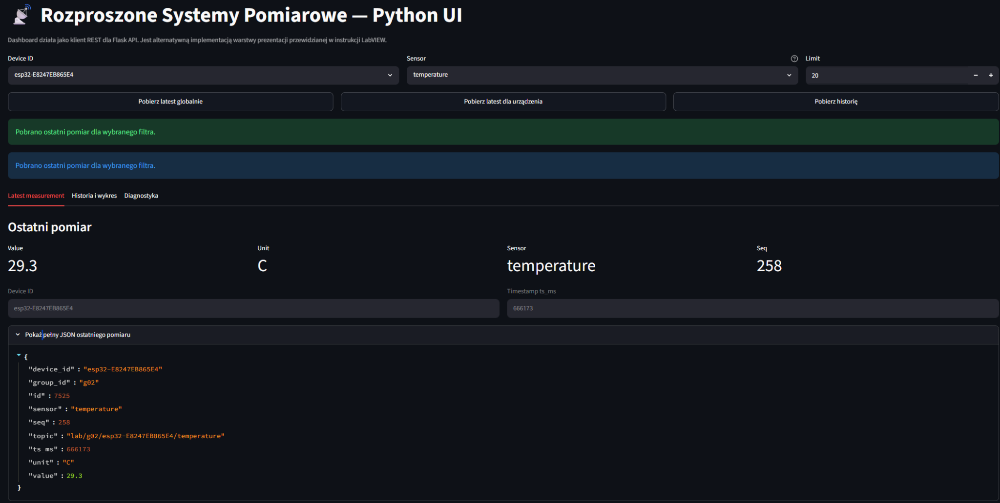
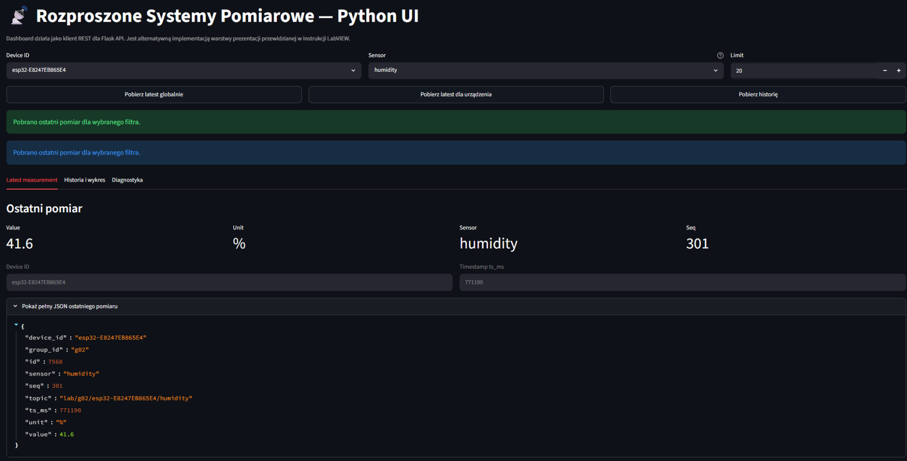

# Rozproszone Systemy Pomiarowe — ESP32, MQTT, PostgreSQL, REST API i Python UI

Projekt semestralny z przedmiotu **Rozproszone Systemy Pomiarowe**. System realizuje pełny przepływ danych pomiarowych od urządzenia ESP32 z czujnikiem DHT22, przez broker MQTT i serwis ingestora, do bazy PostgreSQL, REST API oraz interfejsu użytkownika w Python/Streamlit.

Interfejs użytkownika został wykonany jako alternatywna implementacja warstwy prezentacji przewidzianej pierwotnie dla LabVIEW. Dashboard działa jako klient REST, komunikuje się z backendem Flask i umożliwia podgląd pomiarów temperatury oraz wilgotności.

---

## 1. Architektura systemu

Ogólny przepływ danych w projekcie:

```text
ESP32 + DHT22
    ↓ MQTT publish
Mosquitto MQTT Broker
    ↓ MQTT subscribe
Ingestor Python
    ↓ INSERT
PostgreSQL
    ↓ SELECT
Flask REST API + Basic Auth
    ↓ HTTP GET
Python/Streamlit UI
```

Główne elementy systemu:

| Element | Rola |
|---|---|
| `esp32/` | Firmware ESP32, odczyt DHT22, publikacja MQTT, reconnect Wi-Fi/MQTT |
| `broker/` | Broker MQTT Mosquitto |
| `ingestor/` | Serwis Python odbierający dane z MQTT i zapisujący je do PostgreSQL |
| `database/` | Baza PostgreSQL i skrypt tworzący tabelę `measurements` |
| `api/` | REST API we Flask z Basic Auth |
| `ui/` | Dashboard Python/Streamlit jako klient REST |
| `docs/` | Dokumentacja poszczególnych etapów projektu |

---

## 2. Funkcjonalność projektu

Aktualna wersja projektu obsługuje:

- rzeczywisty odczyt temperatury z czujnika DHT22,
- rzeczywisty odczyt wilgotności z czujnika DHT22,
- publikację danych pomiarowych przez MQTT,
- osobne topiki MQTT dla temperatury i wilgotności,
- topic statusowy urządzenia ESP32,
- mechanizm Last Will and Testament MQTT,
- reconnect Wi-Fi po stronie ESP32,
- reconnect MQTT po stronie ESP32,
- zapis pomiarów do PostgreSQL,
- REST API z endpointami do odczytu danych,
- Basic Auth dla endpointów z danymi,
- dashboard Python/Streamlit z wyborem urządzenia, sensora i limitu rekordów,
- prezentację danych liczbowo, tabelarycznie i graficznie.

---

## 3. Struktura repozytorium

```text
Rozproszone-systemy-pomiarowe/
├── api/
│   ├── app.py
│   ├── auth.py
│   ├── db.py
│   ├── Dockerfile
│   └── requirements.txt
│
├── broker/
│   ├── Dockerfile
│   └── mosquitto.conf
│
├── database/
│   ├── Dockerfile
│   └── 01-init_database.sql
│
├── docs/
│   ├── api.md
│   ├── basic_auth.md
│   ├── dht22_measurements.md
│   ├── message_contract.md
│   ├── message_contract_dht22_supplement.md
│   ├── reliability_esp32.md
│   ├── ui_dashboard.md
│   └── assets/
│       ├── ui_temperature.png
│       └── ui_humidity.png
│
├── esp32/
│   ├── include/
│   │   ├── dht22_service.h
│   │   └── secrets.h
│   ├── src/
│   │   ├── dht22_service.cpp
│   │   └── main.cpp
│   └── platformio.ini
│
├── ingestor/
│   ├── db.py
│   ├── Dockerfile
│   ├── ingestor.py
│   └── requirements.txt
│
├── ui/
│   ├── app.py
│   ├── api_client.py
│   ├── config.py
│   ├── README.md
│   └── requirements.txt
│
└── docker-compose.yml
```

---

## 4. Wymagania

Do uruchomienia projektu potrzebne są:

- Docker Desktop,
- Docker Compose,
- Python 3.10 lub nowszy,
- Visual Studio Code,
- PlatformIO,
- ESP32,
- czujnik DHT22,
- MQTT Explorer do diagnostyki MQTT.

---

## 5. Konfiguracja ESP32

Plik konfiguracyjny dla ESP32 znajduje się w:

```text
esp32/include/secrets.h
```

Przykładowa zawartość:

```cpp
#pragma once

#define WIFI_SSID "NAZWA_SIECI_WIFI"
#define WIFI_PASSWORD "HASLO_WIFI"

#define MQTT_HOST "192.168.31.112"
#define MQTT_PORT 1883
#define MQTT_GROUP "g02"
```

`MQTT_HOST` powinien wskazywać adres IP komputera, na którym działa broker MQTT. Jeżeli ESP32 i komputer są w tej samej sieci lokalnej, można sprawdzić adres komputera poleceniem:

```bash
ipconfig
```

Na Windowsie należy odczytać adres z aktywnego adaptera sieciowego, np. `Ethernet` lub `Wi-Fi`.

> Uwaga: pliku `secrets.h` nie należy commitować do repozytorium, jeżeli zawiera prawdziwe hasło Wi-Fi.

---

## 6. Czujnik DHT22

W projekcie dodano osobną bibliotekę do obsługi czujnika DHT22:

```text
esp32/include/dht22_service.h
esp32/src/dht22_service.cpp
```

Domyślnie pin danych DHT22 ustawiono na:

```cpp
#define DHT22_DATA_PIN 4
```

Typowe podłączenie:

```text
DHT22 VCC  -> 3V3
DHT22 GND  -> GND
DHT22 DATA -> GPIO4
```

Jeżeli używany jest sam czujnik bez gotowego modułu, wymagany jest rezystor podciągający około `4.7k–10k` między linią `DATA` i `3V3`.

Firmware ESP32 publikuje dwa typy pomiarów:

```text
lab/g02/<device_id>/temperature
lab/g02/<device_id>/humidity
```

Przykładowy komunikat temperatury:

```json
{
  "schema_version": 1,
  "group_id": "g02",
  "device_id": "esp32-E8247EB865E4",
  "sensor": "temperature",
  "value": 29.3,
  "unit": "C",
  "ts_ms": 666173,
  "seq": 258
}
```

Przykładowy komunikat wilgotności:

```json
{
  "schema_version": 1,
  "group_id": "g02",
  "device_id": "esp32-E8247EB865E4",
  "sensor": "humidity",
  "value": 41.6,
  "unit": "%",
  "ts_ms": 771190,
  "seq": 301
}
```

---

## 7. Uruchomienie backendu Docker Compose

Z głównego folderu projektu:

```bash
docker compose up -d --build
```

Sprawdzenie statusu kontenerów:

```bash
docker compose ps
```

Oczekiwane kontenery:

```text
api        Up
broker     Up
ingestor   Up
postgres   Up
```

Dostępne usługi:

| Usługa | Adres/port |
|---|---|
| Flask REST API | `http://localhost:5001` |
| MQTT Broker | `localhost:1883` |
| PostgreSQL | `localhost:5432` |

Zatrzymanie środowiska:

```bash
docker compose down
```

Podgląd logów ingestora:

```bash
docker compose logs -f ingestor
```

Podgląd logów API:

```bash
docker compose logs -f flask
```

---

## 8. Baza danych

Baza PostgreSQL tworzona jest w kontenerze `postgres`. Tabela pomiarowa znajduje się w pliku:

```text
database/01-init_database.sql
```

Struktura tabeli:

```sql
CREATE TABLE IF NOT EXISTS measurements (
    id SERIAL PRIMARY KEY,
    group_id TEXT,
    device_id TEXT NOT NULL,
    sensor TEXT NOT NULL,
    value DOUBLE PRECISION NOT NULL,
    unit TEXT,
    ts_ms BIGINT NOT NULL,
    seq INTEGER,
    topic TEXT,
    received_at TIMESTAMP DEFAULT CURRENT_TIMESTAMP
);
```

Sprawdzenie rekordów w bazie:

```bash
docker exec -it postgres psql -U postgres -d postgres
```

Następnie w konsoli `psql`:

```sql
SELECT id, device_id, sensor, value, unit, ts_ms, seq, topic, received_at
FROM measurements
ORDER BY id DESC
LIMIT 20;
```

Wyjście z `psql`:

```sql
\q
```

---

## 9. REST API

REST API działa we Flask i znajduje się w folderze:

```text
api/
```

Dostępne endpointy:

| Endpoint | Dostęp | Opis |
|---|---|---|
| `GET /health` | publiczny | Sprawdzenie działania API |
| `GET /devices` | Basic Auth | Lista dostępnych `device_id` |
| `GET /measurements` | Basic Auth | Ostatnie rekordy pomiarowe |
| `GET /measurements/latest` | Basic Auth | Najnowszy rekord globalnie |
| `GET /measurements/history` | Basic Auth | Historia pomiarów z filtrami |

Dane logowania Basic Auth ustawione są w `docker-compose.yml`:

```yaml
environment:
  API_USERNAME: student
  API_PASSWORD: student
```

### Test API

Endpoint publiczny:

```bash
curl http://localhost:5001/health
```

Endpoint chroniony bez hasła powinien zwrócić `401 Unauthorized`:

```bash
curl -i http://localhost:5001/devices
```

Endpoint chroniony z poprawnymi danymi:

```bash
curl -u student:student http://localhost:5001/devices
```

Historia temperatury:

```bash
curl -u student:student "http://localhost:5001/measurements/history?device_id=esp32-E8247EB865E4&sensor=temperature&limit=5"
```

Historia wilgotności:

```bash
curl -u student:student "http://localhost:5001/measurements/history?device_id=esp32-E8247EB865E4&sensor=humidity&limit=5"
```

---

## 10. Python UI / Streamlit Dashboard

Interfejs użytkownika znajduje się w folderze:

```text
ui/
```

Dashboard działa jako klient REST dla Flask API. Umożliwia:

- test połączenia z API,
- wpisanie danych Basic Auth,
- pobranie listy urządzeń,
- wybór `device_id`,
- wybór sensora: `temperature` lub `humidity`,
- ustawienie limitu rekordów,
- pobranie ostatniego pomiaru,
- pobranie historii pomiarów,
- prezentację ostatniego pomiaru liczbowo,
- prezentację historii w tabeli,
- prezentację historii na wykresie,
- diagnostykę używanych endpointów.

### Instalacja i uruchomienie UI

Z głównego folderu projektu:

```bash
cd ui
python -m venv .venv
source .venv/Scripts/activate
pip install -r requirements.txt
streamlit run app.py
```

Jeżeli aktywacja środowiska w Git Bash nie działa, można uruchomić UI bez aktywacji:

```bash
.venv/Scripts/python -m pip install -r requirements.txt
.venv/Scripts/python -m streamlit run app.py
```

Domyślnie dashboard otwiera się pod adresem:

```text
http://localhost:8501
```

W panelu bocznym należy podać dane Basic Auth:

```text
Username: student
Password: student
```

---

## 11. Przykład działania dashboardu

### Odczyt temperatury

Dashboard pokazuje ostatni rzeczywisty pomiar temperatury z DHT22. Na przykładzie widoczna jest temperatura `29.3 C` dla urządzenia `esp32-E8247EB865E4`.



### Odczyt wilgotności

Po zmianie sensora na `humidity` dashboard pokazuje pomiar wilgotności. Na przykładzie widoczna jest wilgotność `41.6 %` dla tego samego urządzenia.



---

## 12. MQTT Explorer

Do diagnostyki MQTT można użyć programu MQTT Explorer.

Konfiguracja dla brokera lokalnego:

```text
Host: localhost
Port: 1883
Protocol: mqtt://
Username: puste
Password: puste
TLS: wyłączone
```

Jeżeli ESP32 łączy się z brokerem na komputerze przez sieć lokalną, w `secrets.h` należy użyć adresu IP komputera, np.:

```cpp
#define MQTT_HOST "192.168.31.112"
```

Subskrybowany topic diagnostyczny:

```text
lab/g02/+/+
```

Typowe topiki:

```text
lab/g02/esp32-E8247EB865E4/temperature
lab/g02/esp32-E8247EB865E4/humidity
lab/g02/esp32-E8247EB865E4/status
```

---

## 13. Niezawodność ESP32

Firmware ESP32 zawiera mechanizmy zwiększające niezawodność:

- `connectWiFiIfNeeded()` — cykliczne sprawdzanie i reconnect Wi-Fi,
- `connectMqttIfNeeded()` — cykliczne sprawdzanie i reconnect MQTT,
- `publishStatus()` — publikacja statusów technicznych,
- Last Will and Testament — publikacja `offline` po niepoprawnym rozłączeniu ESP32.

Topic statusowy:

```text
lab/g02/<device_id>/status
```

Przykład statusu online:

```json
{
  "schema_version": 1,
  "group_id": "g02",
  "device_id": "esp32-E8247EB865E4",
  "status": "online",
  "ts_ms": 123456
}
```

Ingestor ignoruje topic `/status`, ponieważ do bazy zapisywane są tylko dane pomiarowe zawierające pola `sensor`, `value` i `ts_ms`.

---

## 14. Typowe problemy i rozwiązania

### ESP32 nie łączy się z brokerem MQTT, `rc=-2`

Najczęściej oznacza to, że ESP32 nie może dostać się do komputera na porcie `1883`. Należy sprawdzić:

- czy broker działa,
- czy `MQTT_HOST` wskazuje adres IP komputera,
- czy ESP32 i komputer są w tej samej sieci,
- czy Windows Firewall nie blokuje portu `1883`.

Reguła firewall dla portu MQTT:

```cmd
netsh advfirewall firewall add rule name="MQTT 1883" dir=in action=allow protocol=TCP localport=1883
```

Restart brokera:

```bash
docker compose restart broker
```

### API działa na `/health`, ale `/devices` zwraca błąd bazy

Należy uruchomić cały projekt, a nie tylko kontener API:

```bash
docker compose up -d --build
```

Sprawdzić kontenery:

```bash
docker compose ps
```

### Po Basic Auth UI pokazuje `401 Unauthorized`

W panelu bocznym UI należy wpisać:

```text
Username: student
Password: student
```

### Błąd `DHT.h: No such file or directory`

Należy sprawdzić `esp32/platformio.ini`, czy zawiera biblioteki:

```ini
lib_deps =
    knolleary/PubSubClient@^2.8
    bblanchon/ArduinoJson@^7.4.3
    adafruit/DHT sensor library@^1.4.6
    adafruit/Adafruit Unified Sensor@^1.1.15
```

---

## 15. Dokumentacja szczegółowa

Dodatkowe dokumenty znajdują się w folderze `docs/`:

| Plik | Opis |
|---|---|
| `docs/message_contract.md` | Kontrakt wiadomości MQTT |
| `docs/message_contract_dht22_supplement.md` | Uzupełnienie kontraktu dla DHT22 |
| `docs/dht22_measurements.md` | Opis rzeczywistych pomiarów temperatury i wilgotności |
| `docs/api.md` | Dokumentacja REST API |
| `docs/ui_dashboard.md` | Dokumentacja Python UI |
| `docs/reliability_esp32.md` | Reconnect Wi-Fi/MQTT, status topic, Last Will |
| `docs/basic_auth.md` | Basic Auth i testy bezpieczeństwa |

---

## 16. Szybka procedura uruchomienia całego systemu

1. Uruchom Docker Desktop.

2. Uruchom backend:

```bash
docker compose up -d --build
```

3. Sprawdź kontenery:

```bash
docker compose ps
```

4. Wgraj firmware ESP32 przez PlatformIO.

5. Sprawdź logi ingestora:

```bash
docker compose logs -f ingestor
```

6. Uruchom dashboard:

```bash
cd ui
source .venv/Scripts/activate
streamlit run app.py
```

7. W UI wpisz dane Basic Auth:

```text
student / student
```

8. Wybierz urządzenie, sensor `temperature` lub `humidity` i pobierz historię.

---

## 17. Uwagi końcowe

Projekt przedstawia kompletny rozproszony system pomiarowy: od fizycznego czujnika DHT22, przez komunikację MQTT, zapis w bazie danych, REST API z podstawową autoryzacją, aż do dashboardu użytkownika. System został przygotowany modułowo, dzięki czemu poszczególne warstwy można rozwijać niezależnie.

W obecnej wersji `ts_ms` po stronie ESP32 jest generowany jako czas od startu urządzenia z użyciem `millis()`. W wariancie docelowym można rozszerzyć firmware o synchronizację NTP i zapisywać czas Unix epoch w milisekundach.
